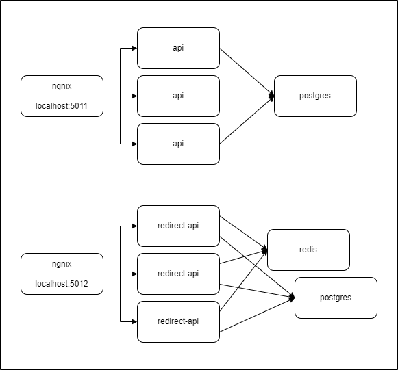

# Shorty

There are two different WebApi applications in this solution.

- __Shorty.Api__ is used to create UrlGroup and Url and
  serves through Controller classes.
- __Shorty.Redirect__ was prepared in the MinApi structure. It fulfills the task of
  redirecting requests to the original url value according to the incoming url information.

## How to run

There are two different docker-compose files under the main directory.

- __docker-compose.yml__ is used to run the application.
- __docker-compose.inf.yml__ is used to run the application's dependencies.

You can create the dependencies needed by the application using the `docker-compose -f docker-compose.inf.yml up -d`
command. After this, you can run or debug any WebApi you want in your local environment through the IDE you use.

If you want to run the application within the docker environment, you can use
the `docker-compose -f docker-compose.inf.yml -f docker-compose.yml up -d` command. After this, you can access the
application from the address (Shorty.Api) `http://localhost:5011` and (Shorty.Redirect) `http://localhost:5012`.

